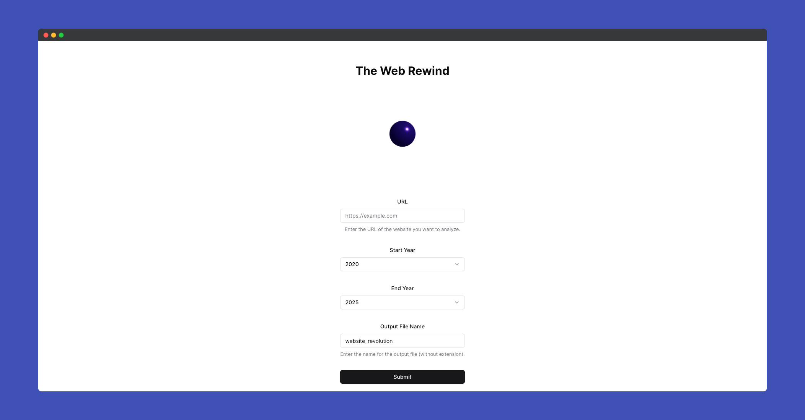

# The Webrewind


Rewinding the evolution of your website.

## Overview

The Webrewind is a tool designed to help developers and designers track and visualize the changes made to a website over time. It provides a comprehensive view of the website's evolution, making it easier to understand the impact of each change.

## Features

- Visualize website changes over time
- Track modifications in design and content
- Easy integration with existing projects

## Screenshot



# Project Structure
```bash
WEBREWIND

├── client
│   ├── node_modules
│   └── public
    └── sr
├── node_modules
├── server
│   ├── node_modules
│   └── docs
│   └── util
├── .gitignore
├── package-lock.json
├── package.json
├── README.md
└── yarn.lock

```

## Getting Started

### Prerequisites

- Node.js (>= 14.x)
- npm (>= 6.x)

### Installation

1. Clone the repository:

   ```bash
   git clone https://github.com/iamspathan/webrewind.git
   cd The-Webrewind
   ```

2. Install dependencies:

   ```bash
   npm install
   ```

### Running Locally

1. Start the development server:

   ```bash
   npm start
   ```

2. Open your browser and navigate to `http://localhost:5173` to view the project.

## Contributing

Contributions are welcome! Please read the [CONTRIBUTING.md](CONTRIBUTING.md) for guidelines.

## License

This project is licensed under the MIT License - see the [LICENSE](LICENSE) file for details.
